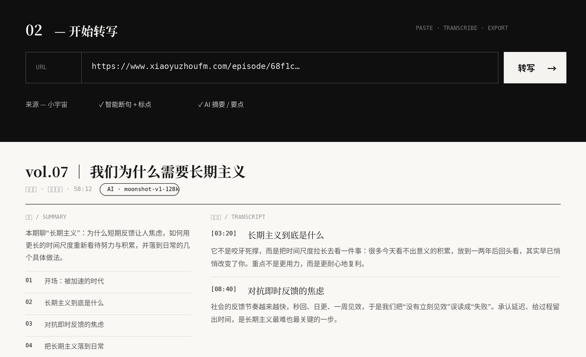

# PodScript · 播客转写器

把**小宇宙 / 苹果播客 / B 站**的一条链接，变成带时间戳的逐字稿 + AI 摘要 + 字幕，
落成 [Obsidian](https://obsidian.md) 友好的 Markdown。**本地优先、离线免费、不上传**。



> **▶ 最简单的用法：网页版（推荐）**
> 装好 ffmpeg 后，在项目目录里跑一条 **`bash start.sh`** —— 它会自动建环境、装依赖、起服务并打开浏览器（**http://127.0.0.1:8000**）。
> 然后：粘链接 → 点「转写」→ 看摘要 / 大纲 / 逐字稿 → 一键导出。界面化操作，新手首选，比命令行直观得多。
> （网页在你**本地**运行、数据不出本机，因此没有公网地址。）

```
链接  →  下载音频  →  语音转录  →  断句·标点·去口水·摘要  →  Markdown / TXT / SRT
```

- **三个来源**：小宇宙、苹果播客、B 站。
- **转录恒本地**：用 `faster-whisper`，离线免费、不上传（无云端 ASR）。
- **清洗 + 摘要可选**：接一个 **OpenAI 兼容**大模型（OpenAI / DeepSeek / Kimi / 智谱 GLM 等，填 base_url + key + model）；不接则只出带时间戳逐字稿、照常可用。
- **两种用法**：命令行 `cli.py`，或本地网站（FastAPI + 单页前端）。
- **按话题分段 + 可点大纲**：接大模型时按话题把全文切成若干段、每段配小标题，并在段内自动分小段；网页左侧生成**可点击跳转、滚动悬浮**的大纲。纯本地则按每 10 分钟分段。
- **同链接免重听写**：同一条链接再转会复用已缓存的逐字稿，跳过下载与转录，秒级重出清洗/分段（方便迭代）。
- **来源透明**：结果区标明本次由「本地 Whisper」还是「AI · 模型名」产出；接不通模型时直接显示原因，不静默降级。
- **区分说话人 · 访谈（可选）**：勾选后用 [pyannote](https://github.com/pyannote/pyannote-audio) 做声纹分离，访谈/多人播客按「说话人1 / 说话人2 …」分轮次显示。需额外装依赖 + 配 HF token，见下「说话人分离」。
- 转录后**自动删音频**（文本优先）；原始带时间戳稿留档在 `_raw_podcast/`，重洗不用重下。

---

## 安装

需要 **Python 3.10+** 和 **ffmpeg**。

```bash
git clone <this-repo> podscript && cd podscript

# 系统依赖
brew install ffmpeg          # macOS
# sudo apt install ffmpeg    # Debian/Ubuntu

# Python 依赖
python -m venv .venv && source .venv/bin/activate
pip install -r requirements.txt
```

`faster-whisper` 首次运行会自动下载语音模型（默认 `small`，几百 MB）。

---

## 用法 A · 网页版（推荐）

> 新手首选：图形界面、粘链接即用，带按话题分段与可点击的悬浮大纲，操作比命令行直观。

**一键启动**（自动建环境 + 装依赖 + 起服务 + 开浏览器，新手用这个）：

```bash
bash start.sh          # 首次会装依赖，稍久；之后基本秒开
```

或手动启动（已自行装好依赖时）：

```bash
uvicorn backend.app:app --reload --port 8000
# 浏览器打开 http://127.0.0.1:8000
```

粘贴链接 → 点「转写」→ 在线看摘要 / 要点 / 逐字稿，一键导出 **MD / TXT / SRT**。
转录始终本地跑；顶部「接大模型」可填一个 OpenAI 兼容大模型让摘要更聪明，不接则纯本地、只出逐字稿。

**落点同样不替你猜**：输入框「落点 / OUTPUT」填你的 vault 路径（存浏览器 localStorage、复用），
没设过会在第一次转写时提示你设置；服务器把 md 写到该目录，结果区显示「已保存到 `<绝对路径>`」。
留空则落到服务器的 `./output/`。

---

## 用法 B · 命令行（进阶 / 批量）

```bash
python cli.py <链接> [选项]
```

```bash
# 小宇宙
python cli.py https://www.xiaoyuzhoufm.com/episode/xxxxxxxx
# 苹果播客
python cli.py "https://podcasts.apple.com/cn/podcast/.../id1234567890?i=1000600000000"
# B 站
python cli.py https://www.bilibili.com/video/BVxxxxxxxxxx
```

常用选项：

| 选项 | 说明 | 默认 |
|---|---|---|
| `--vault DIR` | 落库目录（本次临时覆盖，不写配置） | 见下「落点」 |
| `--whisper-model` | `tiny`/`base`/`small`/`medium`/`large-v3` | `small` |
| `--no-summary` | 不出摘要/要点 | 出 |
| `--no-punctuate` | 不做断句标点（保留原始 ASR） | 做 |
| `--keep-audio` | 转录后保留音频 | 删 |

### 落点：工具不替你猜，第一次问一次

每个人的 Obsidian 结构都不一样，所以 PodScript **不默认乱落**：

- **首次运行**会问一句「转录稿落到哪个文件夹？」，你填自己的 vault 路径，
  存到 `~/.podscript/config.json`，**之后复用、不再每次问**。
- 想换落点：直接编辑 `~/.podscript/config.json` 的 `vault`，或删掉它让它重新问。
- `--vault DIR` 只是**本次临时覆盖**，不写入配置：
  ```bash
  python cli.py <链接> --vault ~/Obsidian/MyVault/播客转录
  ```
- 非交互环境（脚本/cron）没配置时，退回项目默认 `./output/` 并提示，不会卡住等输入。

---

## 摘要 / 要点用哪个 LLM？

清洗（断句标点、去口水）和摘要要点是**一遍 LLM**。按以下优先级自动取 key（都没有就降级到
正则去口水、不出摘要，逐字稿照常产出）：

1. 网站「接大模型」弹层填的 base_url + key + model（OpenAI 兼容端点）
2. 环境变量 `OPENAI_API_KEY`（可配 `OPENAI_BASE_URL` / `OPENAI_MODEL`）
3. 环境变量 `DEEPSEEK_API_KEY`

```bash
export OPENAI_API_KEY=sk-...                 # 或
export DEEPSEEK_API_KEY=sk-...
```

---

## 说话人分离（访谈类 · 可选）

访谈、对谈类播客有多个说话人时，可让逐字稿按「说话人1 / 说话人2 …」分轮次显示。
基础转写**用不到**这些，重依赖（torch / pyannote）都是**懒加载**——不开启就不引入。

一次性配置：

```bash
# 1) 装可选依赖（含 torch，体积较大）
pip install -r requirements-diarize.txt

# 2) 到 https://hf.co/settings/tokens 建一个 token（read 权限即可）
# 3) 在 https://huggingface.co/pyannote/speaker-diarization-3.1 页面点接受模型许可
#    （会连带要求接受 pyannote/segmentation-3.0，一并接受）
# 4) 设环境变量
export HF_TOKEN=hf_xxxxxxxx
```

然后在网页转写时勾选 **「区分说话人 · 访谈」** 即可。首次会下载 pyannote 模型（约几十 MB）；
分离计算在本地跑，有 GPU（CUDA / Apple MPS）会自动用，没有则用 CPU（稍慢）。
分离没成功会**自动退回普通分段并显示原因**，不影响逐字稿产出。

> 在 Clash 等 SOCKS 代理下下模型，`requirements-diarize.txt` 已带 `httpx[socks]`；不走代理可忽略。

---

## 输出格式

```markdown
---
来源链接: <url>
平台: 小宇宙 | 苹果播客 | B站
节目: <show>
单集: <title>
时长: <dur>
发布日期: <date>
转录时间: <today>
---

## 摘要
<2-3 句>

## 要点
- …（3-5 条）

## 逐字稿
[00:03] …（清洗后，带时间戳，分段）
```

---

## 配置项（环境变量）

| 变量 | 作用 |
|---|---|
| `PODSCRIPT_VAULT` | 默认落库目录（首次提问时的回车默认值） |
| `PODSCRIPT_CONFIG` | 落点配置文件路径（默认 `~/.podscript/config.json`） |
| `OPENAI_API_KEY` / `OPENAI_BASE_URL` / `OPENAI_MODEL` | 清洗/摘要 LLM（OpenAI 兼容端点） |
| `DEEPSEEK_API_KEY` / `DEEPSEEK_MODEL` | 清洗/摘要 LLM（备选） |
| `HF_TOKEN` / `HUGGINGFACE_TOKEN` | 说话人分离用的 HuggingFace token（见「说话人分离」） |

---

## 不做什么

只做基础转写 + 轻清洗：断句标点、轻度去口水、一段摘要 + 几条要点。
**不做**观点提取、爆款拆解、选题卡这类深加工——保持简单。

---

## License

MIT。
